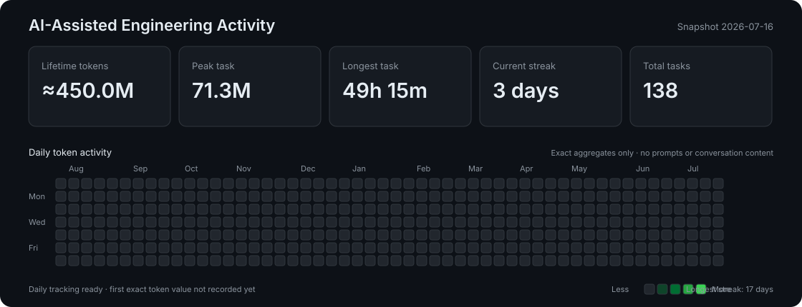

# mystic-rag-prototype

텍스트 문서 기반 RAG QA 챗봇 프로토타입입니다. 이 저장소는 3명이 GitHub에서 동시에 개발을 시작할 수 있도록 최소 프로젝트 구조와 모듈 인터페이스만 제공합니다.

## AI-Assisted Engineering Activity



이 대시보드는 Codex 사용량을 자랑하기 위한 단순 카운터가 아니라, AI를 활용한
개발 활동을 검증 가능한 작업·테스트·커밋과 함께 기록하기 위한 포트폴리오 지표입니다.
공개 데이터에는 날짜별 집계만 포함하며 프롬프트, 대화 내용, API 키는 저장하지
않습니다. 과거 일별 토큰 수는 추측하지 않고, 정확한 값을 확인한 날부터 기록합니다.

일별 값을 추가하고 SVG를 갱신하는 방법:

```bash
python activity/generate_dashboard.py \
  --date 2026-07-17 \
  --tokens 125000 \
  --tasks 2 \
  --commits 1 \
  --tests-passed 4 \
  --note "Implemented and tested document retrieval"
```

이미 기록한 날짜를 다시 입력하면 중복 행을 만들지 않고 해당 날짜를 수정합니다.
토큰 수는 Codex Profile 또는 CLI `/usage`에서 확인한 값만 입력합니다.

## 기술 스택

- Python 3.11
- GEMINI
- LangChain
- LangGraph
- Chroma
- python-dotenv
- CLI 우선 실행
- Streamlit은 추후 선택적으로 추가

## 프로젝트 구조

```text
mystic-rag-prototype/
├── README.md
├── requirements.txt
├── .gitignore
├── .env.example
├── app.py
├── data/
│   └── sample.txt
├── src/
│   ├── __init__.py
│   ├── config.py
│   ├── document_loader.py
│   ├── vector_store.py
│   ├── retriever.py
│   ├── llm.py
│   ├── prompts.py
│   └── graph.py
├── tests/
│   └── test_questions.md
└── docs/
    └── architecture.md
```

## 설치 방법

```bash
git clone <repository-url>
cd mystic-rag-prototype
python -m venv .venv
source .venv/bin/activate
pip install -r requirements.txt
```

Windows PowerShell에서는 다음 명령으로 가상환경을 활성화합니다.

```powershell
.\.venv\Scripts\Activate.ps1
```

## 가상환경 생성 방법

```bash
python3.11 -m venv .venv
source .venv/bin/activate
python --version
```

## 환경변수 설정

```bash
cp .env.example .env
```

`.env` 파일에 실제 OpenAI API 키를 입력합니다. `.env`는 Git에 올리지 않습니다.

```env
OPENAI_API_KEY=your_real_api_key_here
```

## 실행 방법

RAG 문서 적재 및 검색 스모크 테스트는 다음 명령으로 실행합니다. 처음 실행하면
샘플 문서의 청크를 출력하고, OpenAI 임베딩으로 Chroma에 저장한 뒤 질문 3개의
검색 결과를 출력합니다.

```bash
python -m scripts.rag_smoke_test
```

API 호출 없이 Loader와 Chroma 연결을 자동 테스트하려면 다음 명령을 사용합니다.

```bash
python -m unittest discover -s tests -v
```

생성된 `chroma_db/`와 실제 API 키가 들어 있는 `.env`는 Git에서 제외됩니다.

## 학습 리포트

환경 설정부터 Loader, Chunk, Embedding, Chroma, 검색 테스트까지의 개념과 실습은
[`docs/rag_study_report.md`](docs/rag_study_report.md)에 누적해서 정리합니다.

## Git 협업 규칙

- `main` 브랜치는 항상 실행 가능한 기본 상태를 유지합니다.
- 각자 기능별 브랜치를 생성해서 작업합니다.
- 브랜치 이름 예시:
  - `feature/document-loader`
  - `feature/vector-store`
  - `feature/qa-graph`
- Pull Request는 작은 단위로 생성합니다.
- API 키, 비밀번호, 개인 경로는 커밋하지 않습니다.
- 공통 인터페이스를 변경할 때는 팀원에게 먼저 공유합니다.

## 역할별 담당 파일

- 문서 처리 담당:
  - `src/document_loader.py`
  - `data/sample.txt`
- 벡터 DB 및 검색 담당:
  - `src/vector_store.py`
  - `src/retriever.py`
- LLM, 프롬프트, 그래프 담당:
  - `src/llm.py`
  - `src/prompts.py`
  - `src/graph.py`
- 공통 설정 및 실행 진입점:
  - `src/config.py`
  - `app.py`

## 모듈 인터페이스

```python
load_documents(file_path: str) -> list[str]
split_documents(documents: list[str]) -> list[str]
build_vector_store(chunks: list[str]) -> None
retrieve_documents(question: str) -> list[str]
build_prompt(question: str, contexts: list[str]) -> str
generate_answer(question: str, contexts: list[str]) -> str
run_graph(question: str) -> dict
```

## 향후 구현 계획

1. 텍스트 파일 로딩 및 청크 분할 구현
2. Chroma 기반 벡터 저장소 생성
3. 질문 기반 문서 검색 구현
4. OpenAI API 기반 답변 생성 구현
5. LangGraph 기반 RAG 플로우 연결
6. CLI 인터랙션 추가
7. 테스트 질문 세트 확장
8. 선택적으로 Streamlit UI 추가
